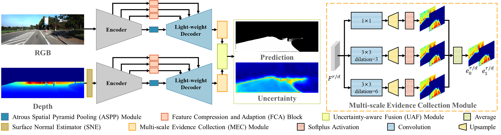

# USNet


### Fast Road Segmentation via Uncertainty-aware Symmetric Network

This repository provides the implementation  of USNet [[arxiv]](https://arxiv.org/abs/2203.04537) in PyTorch.

Road segmentation is significant in self-driving and mobile robot applications. USNet is proposed to achieve a trade-off between speed and accuracy in this task.

<p align="center">

</p>

<p align="center">

</p>


## Data Preparation


#### KITTI Road Dataset

You may download the original images and annotations of on KITTI Road dataset from [KITTI](http://www.cvlibs.net/datasets/kitti/eval_road.php) and the depth images can be found in [SNE-RoadSeg](https://github.com/hlwang1124/SNE-RoadSeg). Then please setup dataset according to the following directory structure:
```
USNet
 |-- data
 |  |-- KITTI
 |  |  |-- training
 |  |  |  |-- calib
 |  |  |  |-- depth_u16
 |  |  |  |-- gt_image_2
 |  |  |  |-- image_2
 |  |  |-- validating
 |  |  |  |-- calib
 |  |  |  |-- depth_u16
 |  |  |  |-- gt_image_2
 |  |  |  |-- image_2
 |  |  |-- testing
 |  |  |  |-- calib
 |  |  |  |-- depth_u16
 |  |  |  |-- image_2
 |-- models
 ...
```


## Installation
The code is developed using Python 3.7 with PyTorch 1.6.0. The code is tested using one NVIDIA 1080Ti GPU card.
You can create a conda environment and install the required packages by running:
```
$ conda create -n usnet python=3.7
$ pip install -r requirements.txt
```


## Training

For training USNet on KITTI Road dataset, you can run:

```
$ cd $USNET_ROOT
$ python train.py
```
When training completed, the checkpoint will be saved to `./log/KITTI_model`.


## Testing

**Note that** before testing you need to config the necessary paths or variables. Please ensure that the checkpoint exists in `checkpoint_path`.

To run the test on KITTI Road dataset:
```
$ python test.py
```
You can download our trained model from [Google Drive](https://drive.google.com/file/d/1qB85Pt-jgnC5wf5-U2ExYBxzjvmaAZNb/view?usp=sharing) or [Baidu Netdisk](https://pan.baidu.com/s/1prA2UsSr5keuCXqewKShCw) (Code: 9zgf). The BEV-results obtained from this released model can be found in [Google Drive](https://drive.google.com/file/d/1MFZwPz141Wgrhk7YW14lPbtwUrJw8LxX/view?usp=sharing) or [Baidu Netdisk](https://pan.baidu.com/s/1c4hT2adWo9-8AIniMVLoXQ) (Code: csar).

If you submit this result to the KITTI benchmark, you will get a MaxF score of **96.87** for **URBAN**, which is similar to the reported ones in our paper.


### Citation

If you find USNet useful in your research, please consider citing:
```
@inproceedings{Chang22Fast,
title = {Fast Road Segmentation via Uncertainty-aware Symmetric Network},
  author = {Chang, Yicong and Xue, Feng and Sheng, Fei and Liang, Wenteng and Ming, Anlong},
  booktitle={IEEE International Conference on Robotics and Automation (ICRA)},
  year={2022}
}
```

## Acknowledgement
The source code of surface normal estimator in our method follows [SNE-RoadSeg](https://github.com/hlwang1124/SNE-RoadSeg), we do appreciate this great work. Besides, the code of acquiring uncertainty in our method is adapted from [TMC](https://github.com/hanmenghan/TMC).
